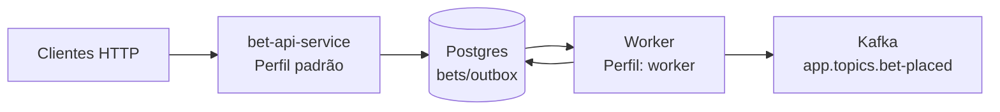
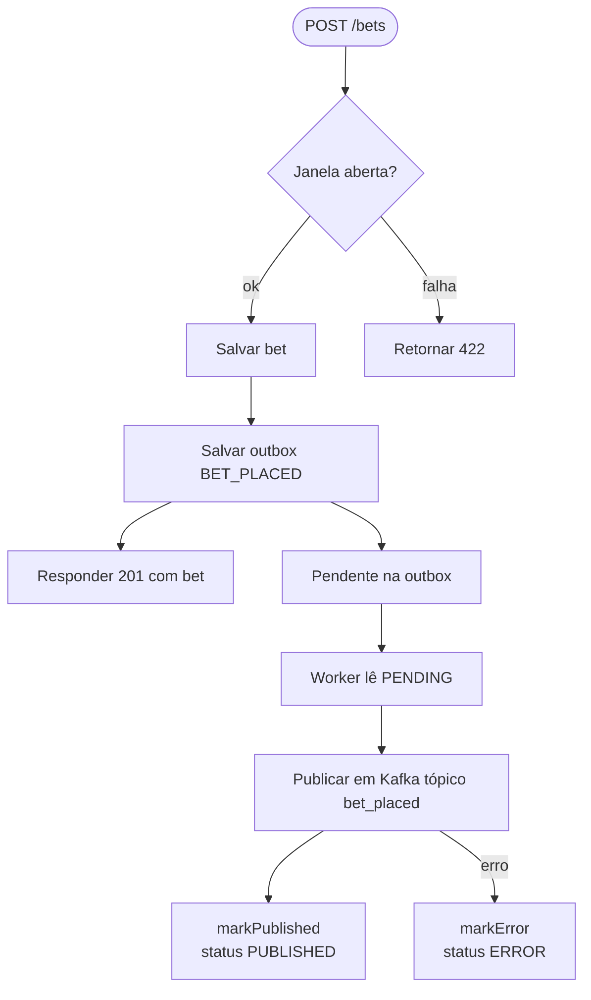

# bet-api-service

API de apostas: recebe apostas para jogos futuros, valida janela, persiste bet e registra evento `BET_PLACED` em outbox
para publicação no Kafka.

## Visão rápida (fluxo)



## Fluxo de processamento /bets



## Endpoints principais

- `POST /games` – cria jogo.
- `GET  /games` – lista paginada.
- `POST /bets` – cria aposta para jogo futuro; valida janela e persiste outbox `BET_PLACED`.

## Eventos publicados no Kafka

- `BET_PLACED` (tópico `app.topics.bet-placed`, ex.: `bets.placed.v1`)
  Payload:
  ```json
  {
    "id": 123,
    "userId": 42,
    "gameId": 10,
    "gameExternalId": 987,
    "selection": "Team A",
    "stake": 100.00,
    "odds": 2.25,
    "status": "PENDING",
    "createdAt": "2024-01-01T12:00:00Z"
  }
  ```
- `GAME_CREATED` (tópico `app.topics.game-created`, ex.: `games.created.v1`)
  Payload:
  ```json
  {
    "eventId": "c6e2f9bc-1c53-4d0d-9c5b-1234567890ab",
    "occurredAt": "2024-01-01T12:00:00Z",
    "emittedAt": "2024-01-01T12:00:01Z",
    "gameId": 10,
    "externalId": 987,
    "homeTeam": "Team A",
    "awayTeam": "Team B",
    "startTime": "2024-01-02T18:00:00Z",
    "status": "SCHEDULED"
  }
  ```
