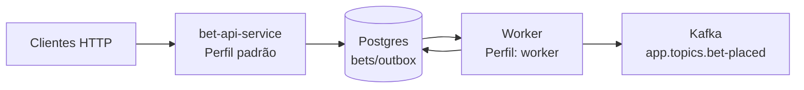

# bet-api-service

API de apostas: recebe apostas para jogos futuros, valida janela, persiste bet e registra evento `BET_PLACED` em outbox
para publicação no Kafka.

## Visão rápida (fluxo)



## Fluxo de processamento /bets


## Endpoints principais

- `POST /games` – cria jogo.
- `GET  /games` – lista paginada.
- `POST /bets` – cria aposta para jogo futuro; valida janela e persiste outbox `BET_PLACED`.

## Evento publicado no Kafka

- Tópico: `app.topics.bet-placed` (ex.: `bets.placed.v1`)
- Payload (`BET_PLACED`):
  ```json
  {
    "id": 123,
    "userId": 42,
    "gameId": 10,
    "gameExternalId": 987,
    "selection": "Team A",
    "stake": 100.00,
    "odds": 2.25,
    "status": "PENDING",
    "createdAt": "2024-01-01T12:00:00Z"
  }
  ```
