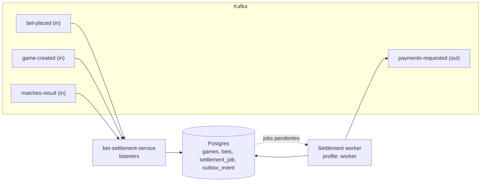
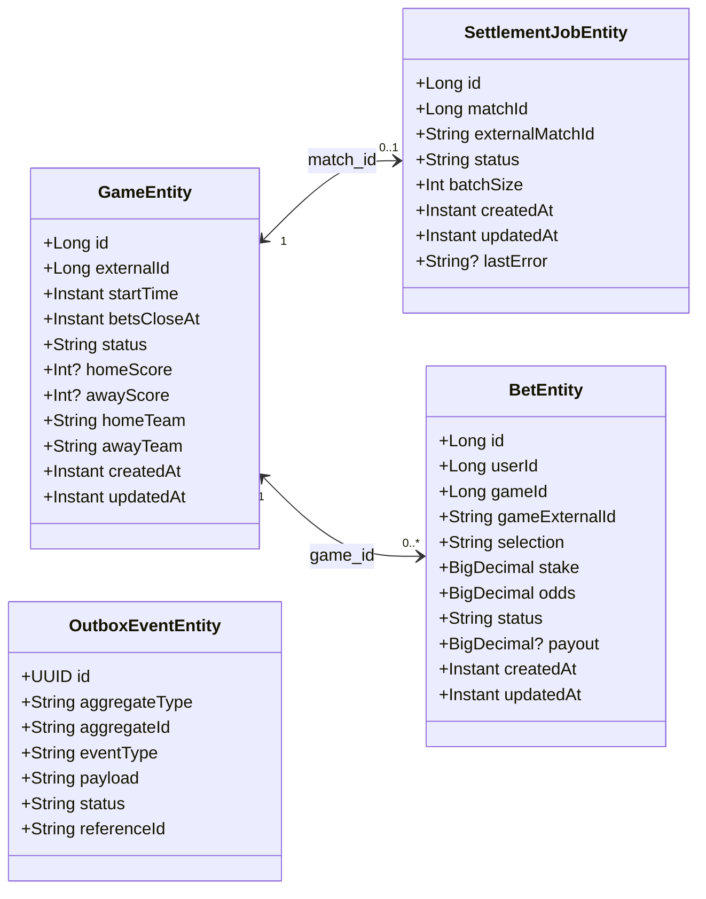

# bet-settlement-service

O bet-settlement-service mantém uma cópia dos jogos e apostas para poder liquidá-las assim que chega o resultado de
cada partida. Ele consome os eventos `bet-placed` e `game-created` para garantir que aposta e jogo estejam alinhados
no próprio banco, e quando recebe `matches-result` aplica o placar, cria um `settlement_job` e dispara a liquidação.
No perfil `worker`, ele varre jobs pendentes, busca apostas ainda não liquidadas, calcula o outcome/payout, e grava
pedidos de pagamento em `outbox_event` para serem publicados como `payments.requested.v1`. Se um resultado chega sem
jogo correspondente, o listener envia para a DLQ (`matches-result-dlq`) via `KafkaErrorHandlerConfig`.

## Visão rápida (fluxo)

## Tópicos Kafka

### Consumidos

- `app.topics.bet-placed`— evento `BetPlacedEvent`.
- `app.topics.game-created` — evento `GameCreatedEvent`.
- `app.topics.matches-result` — evento `MatchesResultEvent` (usa DLQ se não houver jogo).

### Publicados

- `app.topics.payments-requested` (ex.: `payments.requested.v1`) — payload montado pelo worker com `paymentRequestId`,
  `userId`, `totalAmount`, `matchExternalId`.

## Diagrama UML (Entidades JPA)

