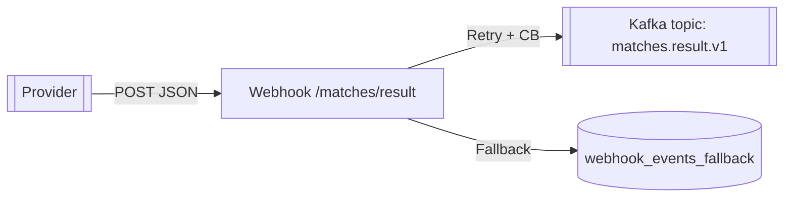

# Result Ingestion Service

Serviço responsável por receber resultados de partidas via webhook e publicar eventos no Kafka.



## Webhook

- Endpoint: `POST /webhook/matches/result`
- Payload:
  ```json
  {
    "matchExternalId": "match-123",
    "homeScore": 2,
    "awayScore": 1,
    "status": "FINISHED",
    "providerEventId": "prov-1"
  }
  ```
- Resposta (202 Accepted):
  ```json
  {
    "status": "ACCEPTED",
    "matchExternalId": "match-123",
    "eventId": "<uuid>"
  }
  ```

## Eventos

- Evento enviado para o tópico `matches.result.v1` (chave = `matchExternalId`):
  ```json
  {
    "eventId": "uuid-gerado",
    "occurredAt": "2024-01-01T12:00:00Z",
    "emittedAt": "2024-01-01T12:00:01Z",
    "matchExternalId": "match-123",
    "homeScore": 2,
    "awayScore": 1,
    "status": "FINISHED",
    "provider": "prov-1"
  }
  ```
